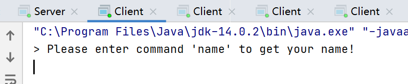
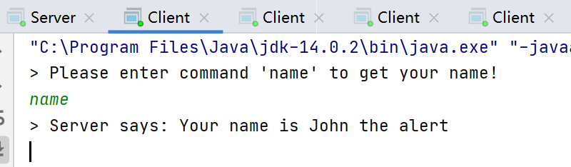
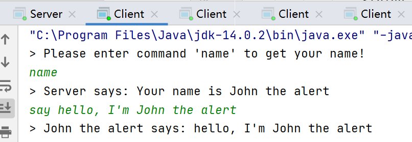
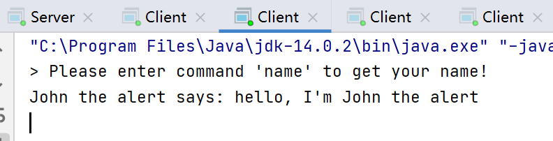
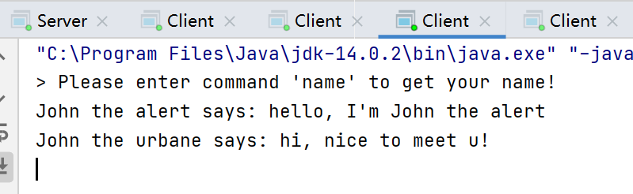
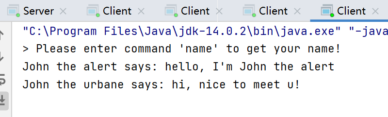
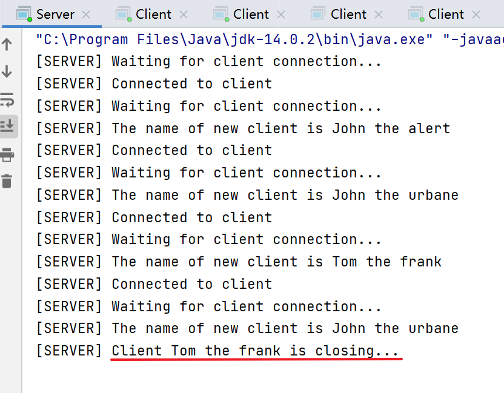

## JAD 多客户端聊天服务器

​	xxx xxxxxxxxxx


#### 1. 实现功能

- 实现一个多客户端的纯文本聊天服务器
- 能够同时接受多个客户端的连接
- 将任意一个客户端发送的文本向所有客户端（包括发送方）转发

#### 2. 效果演示

- 开启服务器，再开启四个客户端：

  

- 服务器打印连接情况，可以看到服务器已经和四个客户端连接，并给四个客户端都分配好了名字：

  

- 客户端输入命令`name`，从服务器那获得自己的名字：

  

- 客户端输入命令`say 待发送的内容`，向所有客户端（包括自己）发送文本内容：

  

  

  

  

- 在第2个客户端执行类似操作：

  

  

  

  

- 在第三个客户端输入`exit`，退出，同时服务器打印该客户端退出的信息：

  

  

#### 3. 服务器实现

- 首先编写一个能够得到随机名字的函数`getRandonName()`
- 创建一个定长线程池，给每个连接进来的客户端都分配一个进程
- 在服务器的主线程（即main线程）里，用一个while循环来不断接收客户端的连接，当接收到一个新的客户端时，给这个新客户端创建一个线程并加入至线程池执行，而后马上返回至accept()函数等待下一个客户端的连接，从而实现多客户端的连接
- 用一个`ArrayList`来指向所有已经连接上的客户端socket，并在创建客户端线程时将该客户端的socket和存储所有客户端的socket都传进去

```Java
private static ArrayList<ClientHandler> clients = new ArrayList<>();
private static ExecutorService pool = Executors.newFixedThreadPool(MAX_CLIENT_NUM);

public static void main(String[] args) throws IOException {
    try (ServerSocket s = new ServerSocket(PORT)) {
        while (true) {
            System.out.println("[SERVER] Waiting for client connection...");
            Socket client = s.accept();
            System.out.println("[SERVER] Connected to client");
            ClientHandler clientThread = new ClientHandler(client, clients);
            clients.add(clientThread);

            pool.execute(clientThread);
        }
    }
}
```

- 在客户端线程`ClientHandler`中
  - 尽可能将其构造函数变得简单，把尽可能多的启动功能放到线程启动后的`run()`中
  - 在线程启动后，构造输入和输出流，并进入while循环
    - 当发现从客户端读到的东西为空，则退出
    - 而后根据客户端发来的命令执行相应的功能
  - 当客户端发来以"say"开头的语句时，需要执行向所有客户端转发的工作
    - 此时需要遍历创建时传入的ArrayList，并把文本放至所有socket的输出流上

```Java
public class ClientHandler implements Runnable {
    private Socket client;
    private BufferedReader in;
    private PrintWriter out;
    private String name;
    private ArrayList<ClientHandler> clients;

    public ClientHandler(Socket clientSocket, ArrayList<ClientHandler> clients) throws IOException {
        this.client = clientSocket;
        this.clients = clients;
    }
    @Override
    public void run() {
        try {
            name = Server.getRandonName();
            System.out.println("[SERVER] The name of new client is " + name);
            in = new BufferedReader(new InputStreamReader(client.getInputStream()));
            out = new PrintWriter(client.getOutputStream(),true);
            out.println("Please enter command 'name' to get your name!");
            while (true) {
                String request = in.readLine();
                if (request == null) break;
                if (request.contains("name")) {
                    out.println("Server says: Your name is " + name);
                } else if (request.startsWith("say")) {
                    int firstSpace = request.indexOf(" ");
                    if (firstSpace != -1) {
                        outToAll(name + " says: " + request.substring(firstSpace+1));
                    }
                } else {
                    out.println();
                }
            }
            System.out.println("[SERVER] Client " + name + " is closing...");
        } catch (IOException e) {
//            e.printStackTrace();
            clients.remove(client);
        } finally {
            try {
                client.close();
            } catch (IOException e) {
                e.printStackTrace();
            }
        }
    }

    private void outToAll(String msg) {
        for (ClientHandler aClient : clients) {
            aClient.out.println(msg);
        }
    }
}
```

#### 4. 客户端实现

- 对每个客户端来说，有三个输入输出流
  - 用户的键盘输入
  - 服务器给过来的输入
  - 给服务器的输出
- 主线程中，处理用户的输入，处理后再把该输入输出到服务器中
- 为了实现服务器的转发功能，给处理“服务器给过来的输入”单独开一个线程，不断试图接收服务器给客户端的消息
- Client类

```Java
public class Client {
    private static final String SERVER_IP = "127.0.0.1";
    private static final int SERVER_PORT = 8880;

    public static void main(String[] args) throws IOException {
        Socket socket = new Socket(SERVER_IP, SERVER_PORT);
        System.out.println(socket);

//        BufferedReader input = new BufferedReader(new InputStreamReader(socket.getInputStream()));
        ServerConnection serverConn = new ServerConnection(socket);
        BufferedReader keyboard = new BufferedReader(new InputStreamReader(System.in));
        PrintWriter out = new PrintWriter(socket.getOutputStream(),true);

        (new Thread(serverConn)).start();
        String command;
        while (true) {
            System.out.print("> ");
            command = keyboard.readLine();

            if (command.equals("exit")) break;

            out.println(command);
        }

        socket.close();
        System.exit(0);
    }
}
```

- ServerConnection.java

```Java
public class ServerConnection implements Runnable{
    private Socket server;
    private BufferedReader in;

    public ServerConnection(Socket s) {
        this.server = s;
    }

    @Override
    public void run() {
        try {
            in = new BufferedReader(new InputStreamReader(server.getInputStream()));
            while (true) {
                String serverResponse = in.readLine();
                if (serverResponse == null) break;
                System.out.println(serverResponse);
            }
        } catch (IOException e) {
            e.printStackTrace();
        } finally {
            try {
                in.close();
            } catch (IOException e) {
                e.printStackTrace();
            }
        }
    }
}
```

